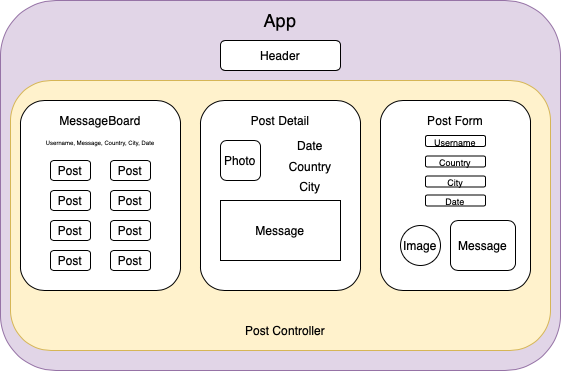

# **Travel Memories✈️✈️✈️**

#### By: **Celeste Field**
#### July 13, 2020
<hr />

### Description

_This application uses React with create-react-app, components, JSX, Firebase/Firestore and props while building a dynamic site with Redux. Users can submit messages via a form, then see them displayed on a sorted messge board by country visited. They are also able to upload their favorite photo of the trip._



<hr />

### Instructions for use:

1. Open Terminal (macOS) or PowerShell (Windows)
2. To download the project Directory to your desktop enter the following commands:
```
cd Desktop
git clone https://github.com/fieldceleste/memory-board.git
cd memory-board
```
3. To view the downloaded files, open them in a text editor or IDE of your choice.
* if you have VSCode for example, when your terminal is within the main project Directory you can open all of the files with the command:
```
code .
```
5. Download node and node package manager if they are not already installed on your device. You can find further instructions [here](https://www.learnhowtoprogram.com/intermediate-javascript/getting-started-with-javascript-8d3b52cf-3755-481d-80c5-46f1d3a8ffeb/installing-node-js-14f2721a-61e0-44b3-af1f-73f17348c8f4).
5. Run npm install in your terminal to download the necessary dependencies, plugins, and modules.
```
npm install
```

6. When ready for production mode run this command in order to optimize the best preformance:
```
npm run build
```

7. The command npm run start will build and open the compiled code in a browser of your choice using a local host.
```
npm run start
```
<hr />

### Known Bugs

No bugs have been identified at the time of this update.

<hr />

### Support and Contact Information

Please contact me with any suggestions or questions at fieldceleste@gmail.com. 
_Have a bug or an issue with this application? [Open a new issue](https://github.com/fieldceleste/memory-board.git/issues) here on GitHub._

### Technologies Used

* JavaScript
* React
* Redux
* Firebase
* JSX
* HTML
* Node.js
* Git and GitHub

<hr />

### User Stories

1. Allows user to create, read, update & delete posts.
2. Allows user to submit their form and have it displayed in the message board. 
3. User can sign up, sign in, and sign out. 
4. User can sign in and have their messages be asscoiated to their username. 
5. Further Exploration- Be able to have the user add photos to their post. 


#### License

This software is licensed under the MIT license.

Copyright © 2020 **_Celeste Field_**